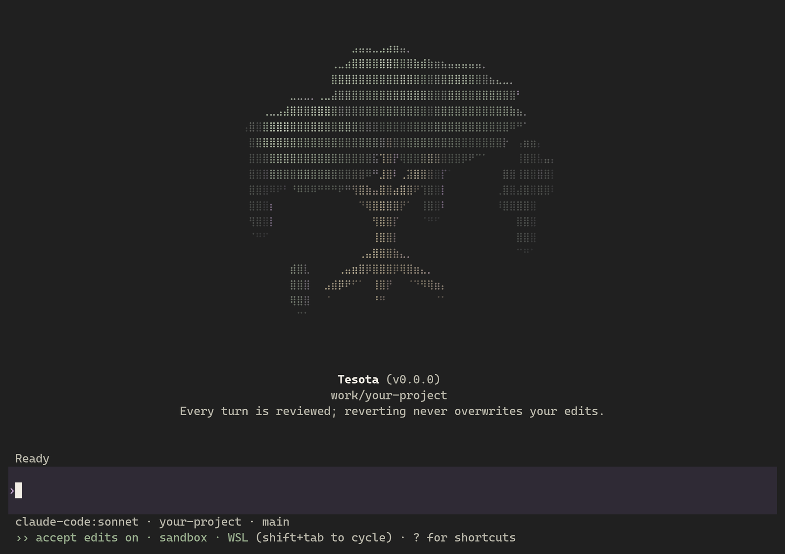

# Tesota

<picture>
  <source media="(prefers-color-scheme: light)" srcset="docs/assets/tesota-welcome-light.png">
  
</picture>

**Tesota is an open-source coding agent that reviews every turn it takes in
your project, and reverts one without overwriting your own edits.** It records
the exact content of each turn, runs your checks and its own verifiers on it,
and presents the diff with an independent review; you keep the turn or
revert it. Checking is proportional, and errs toward checking: a turn that
changes files is always checked and reviewed, more deeply when it touches
tests, what checks it, sensitive files or much code; a turn that only answers
gets a fast first pass, on a typed decision model such as Jev or on any
model, that decides whether its answer needs the full check, and a first pass
that cannot decide runs it, so nothing goes unchecked without you seeing why.
A folder of documents, a second session, or any session that asks,
works in a separate copy that changes nothing until you apply it. Software development
is its first proving ground; work beyond code is planned.

## The name

Tesota takes its name from *Olneya tesota*, the desert ironwood, *palo
fierro* in Spanish: a tree of the Sonoran Desert whose wood is dense enough
to sink in water, and under whose shelter other plants take root. The name
stands for a durable foundation that supports growth.

The [design overview](docs/design/overview.md#name-and-identity) explains the
name and identity.

## Try it

This package is not published. From a source checkout, use the Bun and Node
versions in [package.json](package.json):

```sh
bun install --frozen-lockfile --ignore-scripts
bun run check
bun link
tesota auth login
```

`tesota auth login` lets you choose a route; `tesota auth login codex` signs
in with a ChatGPT plan. Without one, Tesota can use
Claude Code, an Anthropic API key, OpenCode, or OpenRouter;
[choosing models](docs/guide/choosing-models.md) shows the
setup for each.

Then, in the repository you want to work on:

```sh
cd my-project
tesota
```

The agent reads, edits, creates and deletes files in your project, and Tesota
records each turn, checks and reviews it; `/keep` keeps it and `/revert` undoes
it without overwriting what you edited since. `/isolate`, before a session's
first request, makes it work in a copy you apply from instead, as a second
session and a folder that is not a Git repository always do.

<picture>
  <source media="(prefers-color-scheme: light)" srcset="docs/assets/tesota-turn-light.png">
  
</picture>

On Windows, the agent's commands run on their own in Tesota's WSL sandbox,
once `tesota setup` has prepared it (WSL needs an administrator prompt and a
restart once) and Tesota has checked on your computer that the sandbox holds.
The sandbox sees only the project, with `.git` read-only and files that may
hold credentials hidden, and reaches only package registries. Docker
Sandboxes is not used for now, while its network allowlist is checked again:
choosing it runs commands on your computer, outside any virtual machine,
asking before each one. Without a sandbox, every command asks for your
approval first and then runs with your permissions. `tesota sandbox` shows
and chooses where they run.

`tesota run "<request>"` does one request without the shell, for scripts and
benchmarks, allowing only what its flags say. See
[Using Tesota](docs/guide/using-tesota.md) for the workflow and limits. Run
`bun unlink` in this checkout to remove the command.

Tesota is pre-release and has been exercised live only on Windows. A passing
check shows only that the command succeeded on the reviewed content, and a
clean review is advice; neither shows that the change does what you asked. The
[roadmap](docs/roadmap.md) owns status and priorities.

## Documentation

| Need | Read |
| --- | --- |
| The user workflow | [Using Tesota](docs/guide/using-tesota.md), [authentication](docs/guide/authentication.md), [choosing models](docs/guide/choosing-models.md) |
| How it works today | [Design](docs/design/overview.md) |
| Current status and next work | [Roadmap](docs/roadmap.md) |
| Build, test and contribution practice | [Development](docs/development.md) |

Tesota is licensed under [Apache-2.0](LICENSE). Preserve [NOTICE](NOTICE) and
retained third-party notices. See [CONTRIBUTING.md](CONTRIBUTING.md) and
[SECURITY.md](SECURITY.md).
