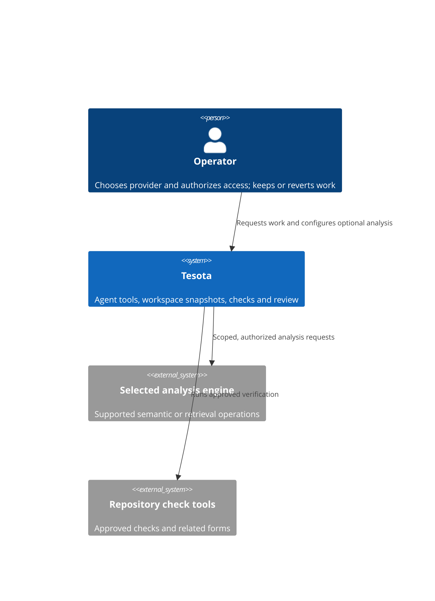
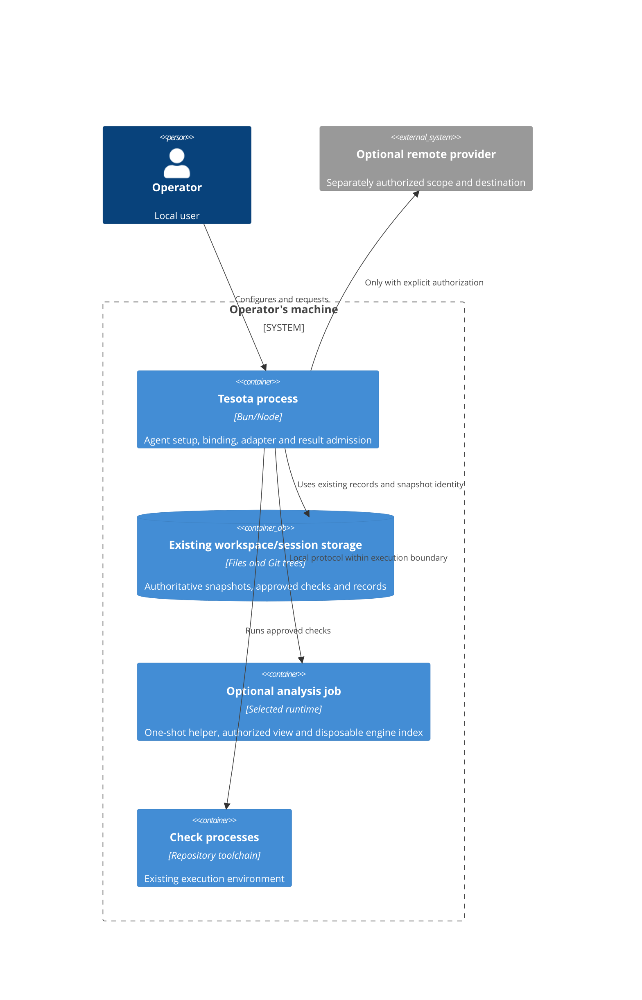

# Repository analysis (proposed)

Status: Proposed integration design; local evaluation direction accepted on
2026-10-06. This page specifies a possible integration boundary; it
does not describe built behavior or add an item to the release roadmap.
The [decision](../decisions/repository-analysis-providers.md) records the tradeoff.

## Decision and existing constraints

Should Tesota consume existing analysis engines, and what may be substituted
without changing its verification promises? Prefer a small integration for an
observed need over a new engine or a general provider framework. A second
integration must serve a concrete consumer before its shared abstraction is
expanded. No provider is selected for implementation by this proposal.

The current owners remain authoritative:

- [Workspace](workspace.md) and `src/workspace.ts`: `WorkspaceSnapshot` owns
  the base, candidate tree, changes and diff; a branch name is not a snapshot.
- [Assurance](assurance.md): approved checks own executed verification.
  Related forms provide intermediate feedback and the whole command runs
  before the operator decides. Agent tool results are feedback.
- [Agents](agents.md) and `workingAgentSetup` in
  `src/integrations/pi-coding-session.ts`: Tesota owns tools across engines.
- [Execution](execution.md) and `src/secret-files.ts`: existing execution,
  network and hidden-file restrictions apply to analysis too.
- [Development](../development.md): a capability needs a real consumer and
  measured benefit before becoming a default. Current concurrency is at most
  two working sessions, as stated in the [overview](overview.md#current-limits).

Out of scope: an independent commercial product, a Criba replacement decision,
new test-selection algorithms, skipping final checks, editing or renaming
through a provider, a public plugin SDK, and arbitrary MCP tool forwarding.
Criba development is paused while existing local providers are evaluated.
It is not a required dependency or an active generalization project. Resume
its evaluation only for a concrete unmet consumer requirement; retirement
remains a separate decision.

## Scenarios and concept contract

1. A request names an error string: the agent searches authorized files.
   Text matches remain useful without a semantic provider.
2. A rename has aliases and homonyms: a semantic query returns references to
   the selected symbol, with project scope and exclusions. It never turns
   textual matches into semantic references.
3. The operator edits a file during a query: the result is either attributable
   to captured content or explicitly unverified; it cannot become candidate
   evidence merely because the process reports ready.
4. A correction round needs faster feedback: the runner's approved related
   form selects tests. Semantic references may suggest candidates, but do not
   authorize narrower checks or establish behavioral test coverage.
5. An operator replaces or disables a semantic provider: text tools and the
   approved checks remain usable; old results do not acquire the new
   provider's identity or guarantees.

Canonical term: **repository analysis**, a Tesota-owned capability for
obtaining scoped facts or suggestions about repository content. It is not a
single interchangeable engine. These dimensions vary independently:

| Concept | Owner and boundary |
| --- | --- |
| Text search | Existing search tools; strings, regex matches and file paths |
| Semantic analysis | Selected engine; symbol identity, definitions, references and diagnostics for its loaded projects |
| Context retrieval | Selected retriever; ranked potentially relevant content, not complete references |
| Test selection | Approved runner/check configuration; which tests the runner selects |
| Verification evidence | Tesota's check/review pipeline; executed result, exact content, claim and limits |
| Provider | The external engine or service answering one supported capability |
| Adapter | Tesota's translation of one engine's protocol and semantics into a consumer's narrow request/result |
| Binding | Operator-authorized choice for a capability in a workspace; not authority to install or upload |

LSP and MCP are transports, not accuracy, freshness or security guarantees.
An analysis provider is distinct from a model route and an execution provider;
selecting one changes neither the model nor the session's execution authority.
An LSP provider, an embedding retriever and tgrep are not interchangeable for
every operation. Multiple languages can use different semantic engines only
when their scopes and result identities are kept distinct.

The working agent consumes advisory results. Checks and review may consume
snapshot-attributed analysis in a later, separately evaluated change.
The operator owns provider choices; Tesota owns admission, authority and what
the UI claims. There is no existing repository-analysis config, result schema
or external consumer to migrate. Machine identifiers and schemas are deferred
until the first implemented operation; this document creates no serialized API.

## Requirements and budgets

| Requirement | Bound or explicit unknown |
| --- | --- |
| Deployment | Operator's machine and existing execution environment; no Sequel-hosted service |
| Concurrent working sessions | Current bound: 2 working turns, not 2 open sessions; first integration permits one analysis job per working turn and none between queries |
| Default behavior | No added provider until a registered evaluation demonstrates benefit; existing text search remains available |
| Configuration | At most one selected provider for each implemented capability/scope; disable is explicit |
| Source eligibility | Only authorized workspace content; hidden files and escaped paths excluded |
| Evidence freshness | Zero tolerance for unattributed content in candidate evidence; live results without attribution are advisory |
| Privacy | No remote upload or new recipient without explicit operator authorization for scope and destination |
| Request rate and corpus size | Unknown; measure real sessions, files, bytes and project count before setting limits |
| Start/query deadlines, CPU, memory and output limits | Unknown; implementation is gated on explicit bounds for the chosen engine and measured Windows behavior |
| Availability and RTO | Unknown numeric target; provider loss must leave the normal editing/check loop usable |
| RPO | No loss of existing authoritative session/check records is permitted by this integration; disposable indexes have no durability guarantee |
| Purchase/API budget | Unknown; no paid provider or recurring spend enabled by this proposal |
| Operation | Operator selects/installs dependencies; Tesota starts, stops and reports the integration it owns |

Numbers for new resource limits are deliberately not inferred from a small
pilot. Before implementation, record deadlines, process limits, maximum
result size and approved cost, and test their enforcement. Selecting a
provider does not authorize its launch executable, network access or billing.

## Context and process boundaries

One Tesota deployment remains. An engine child process is justified only for
the selected capability; its runtime index stays disposable. The first local
adapter uses a bounded one-shot helper inside `ExecutionEnvironment.run`:
the helper opens the engine protocol, makes one operation, emits a bounded
result and stops the engine before exiting. Tesota already receives command
output and cancellation through that interface. It has no writable stdin or
persistent process handle; a persistent LSP would require a separately
qualified extension owned by the execution boundary. Direct host spawning is
not a substitute. The helper's packaging, request framing and confinement
are prerequisites of the selected integration, not existing functionality.
PostgreSQL,
queues, a shared daemon and a new durable cache would add infrastructure
without a requirement here, so none is introduced.

## Data ownership, consistency and lifecycle

Tesota owns workspace identity, effective binding, access policy and result
admission. The engine owns its project model and disposable index. The
existing session/check stores remain authoritative; an engine's cache is
never a session record. Store the effective provider/version and bounded
query summary with any future retained result, without copying credentials.

For each implemented operation, use a specific request/result contract rather
than a generic operation string and optional-field bag. Keep these independent:
outcome (answered, unsupported, unavailable, failed or cancelled); inspected
content identity (attributed or unverified); scope (projects/files and
exclusions); completeness (established for a stated scope or unknown); and
claim kind (resolved symbol fact, diagnostic or ranked suggestion). An empty
answer and failure must be distinct. Health/readiness is a separate lifecycle
state and proves neither coverage nor freshness.

Start only on query demand after checking current authorization, synchronize
the permitted view, answer within a deadline, and dispose on query completion
or cancellation. No engine remains resident between queries or in idle open
sessions. Serialize jobs in each working turn; run them only under the existing
working-turn concurrency bound. Future background or review consumers need
their own capacity decision rather than assuming that bound still applies.
A provider/version/config, effective access-policy or execution-place change
creates a new generation; cancel the old job and reject its late replies.
Cancellation releases resources; a process that cannot stop is reported
unhealthy and blocks further analysis jobs until cleanup is confirmed, so
leaked jobs cannot multiply beyond the stated bound.

For live feedback, serialize synchronization and query per provider instance,
track content generations, and compare the generation before and after.
Concurrent edits or an engine that cannot acknowledge analyzed content make
the result unverified. A file timestamp or watcher silence is insufficient.

For future candidate analysis, query an authorized view derived from the
immutable `WorkspaceSnapshot.tree`. Attribution also identifies the effective
project configuration, dependency/toolchain inputs, access policy and provider
version; a source tree alone does not identify all semantic inputs. If those
inputs are not controlled or the engine cannot establish the inspected view,
retain the result only as advisory. Completeness must name its scoped claim,
not mean "the process loaded without error."

Queries are read-only. No automatic query retry or provider substitution in
the first integration; retry is explicit and uses a new request identity.
Provider replacement applies to the next query after the old generation is
released. No shared persistent analysis cache is designed here.

## Failure, security and operations

| Boundary | Detection, behavior and recovery |
| --- | --- |
| Engine missing, slow or down | Distinct unavailable/timeout result; stop its owned process, keep ordinary tools usable, restart only on explicit retry |
| Partial project or stale index | Record exclusions/unverified identity; never claim complete references or authorize skipped checks |
| Malformed or oversized reply | Validate and bound payload before the model/UI sees it; reject rather than silently dropping malformed entries |
| Cancelled/replaced session or narrowed permission | Recheck authority before each query, cancel in-flight work, reject late replies, dispose the owned process tree; unconfirmed cleanup blocks new analysis jobs |
| Configuration or dependency change | Invalidate attribution and recreate the instance; never reuse an old project model under a new identity |
| Wrong but well-formed result | Preserve provenance and limits; independent checks remain authoritative; protocol validation does not prove truth |
| Remote outage or quota | Return unavailable; no switch to another recipient or paid plan; existing check loop continues |
| Session storage failure | Use existing persistence/error handling; do not report a result as retained when its record was not written |

A read-only protocol is not a sandbox: the server can read files or execute
repository tooling independently. Launch it through existing execution
controls with a sanitized environment and an authorized file view. Do not
give it the raw source root merely because requests use relative paths.
Validate real paths, URIs, symlinks and returned locations against that view;
dependencies needed for semantic resolution must be explicitly eligible too.
Provider text is untrusted content, not instructions or authorization.
Host execution does not enforce hidden-file confinement, as `RunOptions`
in `src/execution-environment.ts` states. The first local integration must
demonstrate its qualified environment/view boundary before claiming workspace
confinement; sanitized variables or filtered output alone cannot establish it.
If the required boundary cannot be enforced, the integration is unavailable
in that execution place. This proposal does not introduce a weaker host mode.

Remote adapters must declare the recipient, transmitted content, credentials
and data-handling implications before activation. Credentials use existing
credential owners, not repository Markdown/config. Repository-supplied launch
commands or endpoints cannot authorize themselves.

Observe startup/query duration, outcome, generation, excluded scope, resource
use and cleanup, with bounded/redacted logs. Deploy with the existing Tesota
release, disabled by default initially; disable the integration to roll back.
There is no new durable datastore or migration. Index loss is recovered by
rebuilding; retention, backup and restore of existing authoritative records
stay with their current owners. Any future persistent result format requires
a version/migration decision and an exercised restore before adoption.

## Capacity and alternatives

The diagnostic pilot used a fresh TS language server per session and reported
1,039 MiB median session-average RSS and 1,274 MiB median peak RSS,
with a 1,917 MiB maximum sampled peak (its sampler divides kB by 1,024).
These Linux observations are not Windows capacity guarantees. Under the
proposed two-concurrent-job bound, a planning estimate is
`2 * 1,039 = 2,078 MiB` average engine RSS, `2 * 1,274 = 2,548 MiB` at median
peaks, or `2 * 1,917 = 3,834 MiB` if both reach that observed maximum. Tesota,
models/toolchains and OS memory are additional; no host budget is yet approved.

At one and three years, corpus bytes and growth are unknown. With corpus size
`B`, measured index ratio `r`, per-instance runtime cost `M` and two active
instances, disposable disk is approximately `2 * B * r` and engine memory
`2 * M`. Re-measure `B`, `r` and `M` at each horizon; no numeric growth forecast
is supported. There is no separate analysis-result store. Tool responses can
increase the existing conversation records: with `Q` queries per year,
`S` retained bytes per response and `Y` years of retention, incremental storage
is approximately `Q * S * Y`. All three inputs are unknown and must be
measured/bounded with the first consumer rather than assuming zero growth.

| Option | Fit and tradeoff |
| --- | --- |
| Existing text tools/checks only | Current viable baseline, smallest cost; model must resolve ambiguity by reading |
| One optional, scoped existing engine | Chosen design direction; adds precise operations where useful, with lifecycle/access cost; broader substitution waits for a second consumer |
| General interchangeable provider framework | Supports hypothetical engines but creates config, qualification and maintenance obligations before demand; deferred |
| New engine owned by Sequel | Maximum control with compiler/index/lifecycle maintenance; unsupported investment until an existing provider fails an observed requirement |

The pilot's 18/18 passes in each arm and only 6/18 semantic-tool-using sessions
do not establish an adoption benefit. False command denials also confounded
cost. This supports retaining the baseline, not declaring semantic engines
useless. First evaluate a real missed-reference or costly-navigation case on
Windows with the same agent/check loop and fresh held-out cases. Measure
correctness, omissions, total completion time, API cost and engine resources.
An implemented provider must pass contract checks for stale/partial/empty
results, path and secret confinement, cancellation, late replies and two
independent workspaces before measured benefit can make it a default.

## Review and unresolved decisions

The advisor challenged three assumptions against the current code:

- The limit of two working turns does not bound idle sessions. Answer: one
  engine job per working turn, disposed after each query, no resident engines
  in idle sessions; unconfirmed cleanup prevents acquiring another job.
- `ExecutionEnvironment.run` cannot expose a persistent LSP's stdin. Answer:
  choose a bounded one-shot helper within that existing interface; any future
  persistent transport must be qualified at the execution boundary.
- A running engine could retain earlier authority after permissions narrow,
  and host execution cannot hide files. Answer: check authority per query,
  invalidate generations and cancel on policy/place changes, and require a
  tested confinement boundary before enabling the integration there.

The simpler lifecycle pays startup cost on every query and may erase its
benefit. Measure that cost before adoption; persistent transport and residency
are separate later decisions if real results justify their complexity.

The operator accepted pausing Criba and beginning local-provider evaluation on
2026-10-06. This does not adopt an adapter, a default engine or remote access.
Before implementation, settle the first real consumer and operation, the engine
to evaluate, and startup/query/output/resource budgets. The integration design
stays Proposed until those choices and its implementation scope are accepted.
